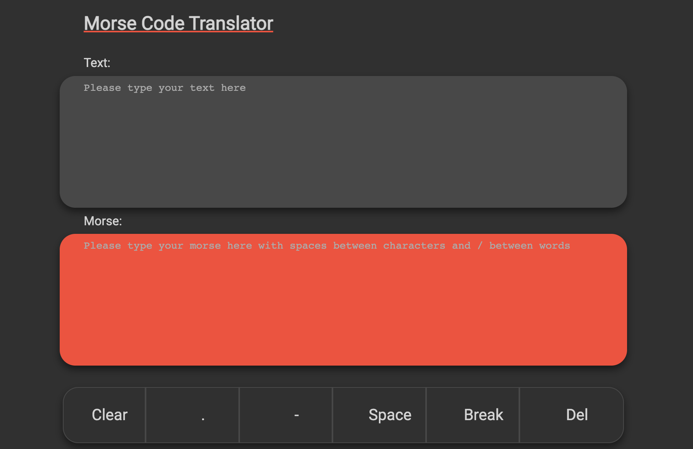

# Morse Code Translater

## Contents

-   Description
-   Live Design
-   Stack
-   Setup
-   Approach
-   Challenges
-   Additions

## Description

### MVP

-   Create a user interface that allows the user to either input some English text or some Morse Code

-   Create JS functions that would allow the user to:
    -   translate their English text into Morse Code
    -   Morse Code into English text
-   Make sure to handle spaces properly (ie. there is 1 space between English words, but one space between Morse Code characters)

-   Make sure to separate pure JS functions and DOM manipulation

-   Add unit testins for each of the pure function that your translator uses (each function should have at least 4 tests, think of edge case, wrong inputs, etc ...)

## Live Design

<figure>

</figure>

## Stack

-   HTML
-   SCSS
-   Javascript

## Setup

Click Here to access live demo of application:

🔗 [Live Demo](https://darcyjhenschke.github.io/Morse-Coder/)

## Approach

The follwoing explains the way I approached this project:

I decided to break this project down into 3 parts:

1. the function to convert a string of english text to morse code
2. the function to convert a string of dots and dashes to english text
3. The DOM logic which would allow a user to interact with the application

Step 1 and 2 from above were quite simple essentially both functions relied on an established library of character/morse pairs. Both functions split the inputted strings of morse or text into an array and than map through these arrays and swap each character of this array to its counterpart in the established library. This array was then joined back into a string.

The DOM logic simply required both text areas to have an onChange event listener. The two functions listed above were than called inside this event listener with the input.value of the text area being the functions parameters. This means that whenever a supported character was inputted in one of the text areas it instanly updated on the opposite text area.

I knew that typing morse from a typical QWERTY keyboard is slighly difficult. Hence I provided buttons for the user which interact with the morse text area. These buttons function via an onclick evetn listeners which concatenate there innerText to that of the text areas input.value.

## Challenges

-   The main problem I was having was to do with the break or slash character which represents a space between words in morse. The issue I was having was that if a space was not provided before and after the slash the code would break. To fix this I chained a replace method into the morse to text pure function. This method replaced a slash with one that had built in space around it.

-   Another Challenge I faced was whenever a user would click a button for a dot, dash or a slash instead of typing it would not immediatly display it in the english text area. I realised after taking a step back from my code that I needed to recall my morse to text function inside the functions which gave the buttons their functionality.

## Additions

-   Put the buttons inside the morse text area so that users have a better understanding of what these buttons interact with
-   Code sound button that plays a text to speech function
-   Find Regex expression that can filter all unwanted characters for each function, therefore preventing characters that cannot be converted from being inputted.
